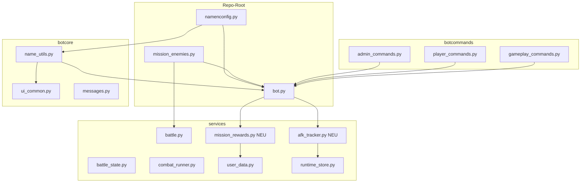

# Design Document

## Overview

v2.3.0 ist ein Sammel-Update mit 22 Anforderungen. Es berührt vier große Bereiche:

1. **Konfiguration & Namens-Layer** — neue zentrale Datei `namenconfig.py` plus erweiterte Markdown-Normalisierung in `botcore/name_utils.py`.
2. **Admin- und Spieler-Tools** — `/karte_geben`, `/verbessern`, „Dust geben", Lödust, „Grant Card", Mode-Schalter im Dev-Panel.
3. **Mission- & Kampf-Logik** — Boss-Karten-Wechsel, Infinitydust-Belohnungen, Boss-Balance-Werte (Maestro/MODOK/Goblin/Kingpin/Agatha), Cooldown-Anzeige, hervorgehobene Boss-Spezial-Meldung.
4. **Kampf-Lifecycle** — Cancel-Buttons (Challenge & Kampf) und persistentes AFK-Markierungssystem.

Alle Karten-Anpassungen (Gamma Mutant, Exo-Suit, Tarnung, Sammlungs-Anzeigen) sind explizit **nicht** Teil dieses Specs und kommen später separat.

Die Codebasis ist `discord.py`-basiert mit zentraler `bot.py` (~17k Zeilen), Service-Layer unter `services/`, Slash-Commands in `botcommands/`, Hilfsfunktionen in `botcore/`. Persistenz läuft über SQLite (`db.py`, `kartenbot.db`) und JSON-Stores in `services/runtime_store.py` / `request_store.py`.

## Architecture

### Komponenten-Übersicht



### Neue Module

| Pfad | Rolle |
|---|---|
| `namenconfig.py` (Repo-Root) | Globale Feature-Toggles `boss_switch_enabled`, `name_normalization_enabled`; auskommentierter Platzhalter `card_name_normalization_enabled`. |
| `services/afk_tracker.py` | Zustands-Logik und Persistenz-Interface des AFK-Markierungssystems (Req. 13). |
| `services/mission_rewards.py` | Pro-Mission-Akkumulator für Infinitydust-Belohnungen (Req. 7). |

Bestehende Dateien werden punktuell erweitert — keine Massen-Refactors.

## Components and Interfaces

### 1. `namenconfig.py` + Loader (Req. 2, 9)

**Datei `namenconfig.py`** (neu, Repo-Root):

```python
# ============================================================
# namenconfig.py — globale Feature-Toggles für v2.3.0
# Änderungen wirken nach Bot-Neustart.
# ============================================================

# ------------------------------------------------------------
# boss_switch_enabled
# ------------------------------------------------------------
# Wirkung: Steuert die Frage „Held wechseln?" vor Boss-Kämpfen.
# True  -> Spieler bekommt vor jedem Boss eine Auswahl aus
#          ALLEN seinen Karten, kann frisch starten.
# False -> Keine Frage, Boss-Kampf startet direkt mit der
#          aktuellen Mission-Karte.
# Erlaubt: True | False
# Default: True
# Beispiel ON  : "Wähle deinen Helden für den Boss-Kampf:"
# Beispiel OFF : (kein Menü; Mission-Karte tritt direkt an)
boss_switch_enabled = True

# ------------------------------------------------------------
# name_normalization_enabled
# ------------------------------------------------------------
# Wirkung: Markdown-aktive Zeichen in Benutzernamen (_, *, ~,
#          `, >, |) werden in Embeds, Buttons, Selects und
#          Pings so dargestellt, dass sie als wörtliche Zeichen
#          sichtbar bleiben (nicht als Markdown interpretiert).
# Erlaubt: True | False
# Default: True
# Beispiel ON  : MFU-_-is_da   (Zeichen sichtbar wie eingegeben)
# Beispiel OFF : MFU-\_-is\_da (Backslashes sichtbar / Italic)
name_normalization_enabled = True

# ------------------------------------------------------------
# Platzhalter — NOCH NICHT AKTIV in v2.3.0
# ------------------------------------------------------------
# Wird in einem späteren Update aktiviert. Für die Karten-Namen
# gibt es derzeit keine bekannten Markdown-Probleme. Der Block
# bleibt auskommentiert, damit du später nur das `#` entfernen
# musst.
#
# card_name_normalization_enabled = False
```

**Loader** (neu in `botcore/name_utils.py` oder eigene Mini-Datei):

```python
# botcore/feature_config.py (oder oben in name_utils.py)
def _load_namenconfig() -> dict:
    """Lädt namenconfig.py defensiv mit Defaults und Logging."""
    defaults = {"boss_switch_enabled": True, "name_normalization_enabled": True}
    try:
        import namenconfig as _cfg
    except Exception:
        logging.warning("namenconfig.py nicht gefunden - Defaults aktiv")
        return defaults
    result = dict(defaults)
    for key in defaults:
        if hasattr(_cfg, key):
            value = getattr(_cfg, key)
            if isinstance(value, bool):
                result[key] = value
            else:
                logging.warning("namenconfig.%s ungültig (%r) - Default %s",
                                key, value, defaults[key])
    return result

NAMENCONFIG = _load_namenconfig()
def boss_switch_enabled() -> bool: return NAMENCONFIG["boss_switch_enabled"]
def name_normalization_enabled() -> bool: return NAMENCONFIG["name_normalization_enabled"]
```

Der Loader wird **einmalig beim Bot-Start** aufgerufen (Modul-Import-Zeit). Tests können `NAMENCONFIG` direkt patchen.

### 2. Boss-Karten-Wechsel mit voller Auswahl (Req. 1)

Aktueller Code: in `bot.py` existieren `MissionNewCardSelectView` (`VIEW_KIND_MISSION_NEW_CARD_SELECT`, Zeile ~10820) und der „Held wechseln"-Pfad in der Mission-Vorschau (Zeile ~9273). Der Spieler bekommt aktuell nur die **ursprünglich gewählte** Karte angeboten.

**Änderung:**
- In `MissionNewCardSelectView.__init__` und beim Build der SelectOptions: alle Karten aus `get_user_karten(user_id)` einlesen, durch `_filter_owned_cards_for_current_mode` schicken und mit `group_owned_cards_by_base` gruppieren. Die Logik ist identisch zur Mission-Start-Karten-Auswahl (`MissionCardSelectView`) — wir extrahieren eine gemeinsame Funktion `_build_owned_card_options(user_id)` und nutzen sie an beiden Stellen.
- Die ursprünglich gewählte Karte wird mit Marker `(aktuell)` als erste Option angezeigt (nicht entfernt).
- Bei Auswahl einer **anderen** Karte: neuer Kampf wird gestartet mit `_start_fresh_boss_battle(user_id, selected_card)` — das setzt HP der neuen Karte auf den konfigurierten Max-Wert, leert Cooldowns und alle Buffs/Debuffs/DoT-Effekte.
- Bei Auswahl der **ursprünglichen** Karte: bisheriger State läuft weiter (kein Reset).
- Toggle-Check: `if not boss_switch_enabled(): direkt Boss-Kampf starten, kein Wechsel-Menü zeigen.`
- Lakei-Encounter: das Wechsel-Menü darf laut Req. 1.5 + 1.7 **nur** bei `seltenheit == "Boss"` erscheinen. Bestehende Verzweigung in `MissionEncounterPreviewView` prüft das bereits.

**Neue Helper:**
```python
def _build_owned_card_options(user_id: int) -> list[SelectOption]: ...
def _start_fresh_boss_battle(user_id: int, card_name: str, mission_state: dict) -> None: ...
```

### 3. Multi/Single-Vereinheitlichung (Req. 3, 4, 5, 11)

**Aktueller Stand:**
- `/karte-geben` (`botcommands/admin_commands.py` Zeile ~249) hat schon Single/Multi-Choice. Die Implementierung läuft über `MultiCardSelectView` und `SingleMultiModeView` in `bot.py`.
- `/dust` (`admin_commands.py` Zeile ~462) hat ebenfalls Single/Multi (über `run_dust_command_flow(remove=False)`).
- `/lödust` (`admin_commands.py` Zeile ~462) ist **identisch** zu `/dust` mit `remove=True` — hat also schon Single/Multi.
- „Grant Card" im Dev-Panel (`bot.py` Zeile ~16153) hat einen Kommentar `# 1:1 wie /karte-geben multi` und nutzt bereits `MultiCardSelectView`.

**Was zu tun ist:**
- **Verifikation per Tests** für `/karte_geben` Single + Multi (Req. 3) — Tests existieren teilweise in `tests/test_combat_rules.py`. Lücken auffüllen: Multi mit Teilfehler (eine Karte kann nicht vergeben werden) muss Multi-Vergabe trotzdem abschließen.
- **„Dust geben" UI-Parität zu `/karte_geben`** (Req. 4) prüfen: Embed-Struktur und Button-Reihenfolge angleichen, Tests hinzufügen.
- **Lödust** (Req. 5): die Schnellauswahl-Beträge `{5,10,15,20,25,30}` plus freies Eingabefeld bestehen schon teilweise (`DUST_MENU_AMOUNTS` enthält aktuell `[5,10,15,20,25,30,35,40,45,50,70,100]`). Anpassen:
  - Multi-Modus zeigt Buttons für `5,10,15,20,25,30`.
  - Top-Modal mit ganzzahligem Custom-Betrag (1 ≤ n ≤ 1.000.000).
  - Validierung 0 / negativ → ablehnen, Fehlermeldung, kein State-Change.
  - Eingabe `0` + aktiver Schnellauswahl-Button → Schnellauswahl gewinnt.
- **Grant Card = `/karte_geben` Multi** (Req. 11): bereits durch shared `MultiCardSelectView`-Pfad in `bot.py` ~16153. Wir extrahieren die Vergabe-Kernlogik in eine gemeinsame Service-Funktion `services/card_grant.py::grant_cards_to_users(actor_id, target_ids, card_names)` und rufen sie aus beiden Pfaden auf, um künftiger Drift vorzubeugen.

### 4. `/verbessern`-Überarbeitung (Req. 6)

Aktueller Code: `FuseCardSelectView` mit `FuseCardActionSelect` (Suchen / Alle durchsuchen / Zurück) + `CardSelect` und Pagination — `bot.py` Zeile ~9043. Der obere Action-Select ist genau das, was der User loswerden will.

**Änderungen:**

1. **Oberes Menü entfernen** — `FuseCardActionSelect` wird nicht mehr instanziiert; in `FuseCardSelectView._render` keine Action-Row mehr aufbauen. Konstanten `FUSE_CARD_ACTION_SEARCH` / `FUSE_CARD_ACTION_BROWSE_ALL` bleiben für Tests deprecated, werden aber nicht mehr im UI verwendet.
2. **Direkt alle Karten zeigen** — `mode = "browse"` beim Konstruktor-Default.
3. **Pagination** — bestehende `prev_button`/`next_button` (Row 2) bleiben. Anzahl Optionen pro Seite = 25 (Discord-Limit). Buttons werden bei Seite 1 / letzter Seite deaktiviert.
4. **Ablauf neu**:
   - Schritt A: Karten-Auswahl (mit Pagination)
   - Schritt B: **Stat-Auswahl** (HP, Damage Attacke 1, Damage Attacke 2 …) — neue View `FuseStatSelectView`
   - Schritt C: **Multiplikator-Auswahl** (1×=5, 2×=10, …, 6×=30) — angepasste `DustAmountView` / `DustAmountSelect`
5. **Multiplikator-Filter (Req. 6.7)**:
   ```python
   def available_multipliers(stat_value: int, stat_cap: int, base_step: int, dust_balance: int) -> list[int]:
       remaining = max(0, stat_cap - stat_value)
       max_by_cap = remaining // base_step  # ganze Schritte bis Cap
       max_by_dust = dust_balance // 5      # Multiplikator passt in Dust-Saldo (Cost = 5*m)
       hard_cap = min(6, max_by_cap)
       return [m for m in range(1, hard_cap + 1)]
   ```
   - Optionen, die wegen `dust_balance` nicht finanzierbar sind, werden **ausgegraut/deaktiviert** (nicht ausgeblendet, Req. 6.9).
   - Optionen über `max_by_cap` werden **ausgeblendet** (Req. 6.7).
6. **HP-Cap 200 global** (Req. 6.8): zusätzlich zur Multiplikator-Filterung greift `final_apply_check`, der vor dem Persistieren erneut prüft, ob `new_hp ≤ 200`. Falls Diskrepanz → Rollback, Fehlermeldung „Cap überschritten".
7. **Dust-Anzeige (Req. 6.10)**: vor `DustAmountView` — der Embed-Header zeigt `💎 Dein Dust-Vorrat: {dust_balance}`.
8. **Bestätigungs-Embed (Req. 6.11)**: nach erfolgreicher Aufwertung Embed mit Vorher/Nachher pro Stat, gekostetem Dust und neuem Saldo.
9. **k=0 / 0 Karten** (Req. 6.12, 6.14): Hinweis-Meldung statt leerem Menü.
10. **Atomares Persistieren** (Req. 6.13): Dust und Stat-Änderung in einer DB-Transaktion. Bei Fehler: kein Teil-Update.

### 5. Infinitydust-Belohnungssystem (Req. 7)

Aktueller Mission-Reward-Pfad: `add_mission_reward(...)` in `services/user_data.py`, `add_infinitydust(...)` ebenfalls dort. Mission-Abschluss läuft über die Mission-Battle-Sequenz in `bot.py` (Encounter-Loop in `MissionBattleView`).

**Neuer Service `services/mission_rewards.py`:**

```python
@dataclass
class MissionRewardAccumulator:
    user_id: int
    mission_id: str
    infinitydust: int = 0
    daily_card_bonus_pending: bool = False

    def on_lakai_defeated(self): self.infinitydust += 1
    def on_boss_defeated(self): self.infinitydust += 1
    def on_daily_card_already_owned(self): self.daily_card_bonus_pending = True
    def total(self) -> int:
        return self.infinitydust + (1 if self.daily_card_bonus_pending else 0)

async def commit_on_mission_success(acc: MissionRewardAccumulator) -> None:
    if acc.total() > 0:
        await add_infinitydust(acc.user_id, acc.total())
        await log_mission_reward(acc)

async def discard_on_mission_failure(acc: MissionRewardAccumulator) -> None:
    pass  # nichts auszahlen
```

**Integration:**
- Mission-Start: `mission_state["reward_accumulator"] = MissionRewardAccumulator(...)`.
- Encounter-Sieg gegen Lakei: `acc.on_lakai_defeated()`.
- Boss-Sieg: `acc.on_boss_defeated()`.
- Daily-Karte schon im Besitz: `acc.on_daily_card_already_owned()` (sofern die Daily-Karte als Mission-Reward verknüpft ist).
- Mission-Erfolg: `commit_on_mission_success(...)` als letzte Aktion **vor** dem End-Embed.
- Mission-Abbruch / Verloren: `discard_on_mission_failure(...)`.

**Daily-Karten-Duplikat außerhalb Mission** (Req. 7.3 + 7.8): bereits an Stelle in `bot.py` ~3248 sichtbar (Daily wird zu Infinitydust umgewandelt, wenn schon im Besitz). Hier zusätzlich `+1 Infinitydust` direkt gutschreiben, ohne Mission-Akkumulator.

### 6. Thumbnail-Audit (Req. 8)

Stellen mit `set_image(...)` aus dem Grep-Lauf in `bot.py`:

| Zeile | Kontext | Bewertung |
|---|---|---|
| 2877 | Daily-Karte als Belohnung | OK (Karte-Bild groß ist hier gewollt) → bleibt |
| 3053 | Encounter-Vorschau Gegner-Bild | OK |
| 3217, 3239 | Daily-Zieh-Animation | OK |
| 3249 | Daily wenn schon besessen → Infinitydust | **FIX** — derzeit `image=True, thumbnail=True`. Auf reines Thumbnail umstellen. |
| 7887, 7902, 7904 | Reward-Embed | **FIX** prüfen — wenn `dust_image_url` gesetzt wird (`set_image`), Dust groß. Auf Thumbnail-only umstellen. |
| 11437/39, 13281/83, 14031/33, 14082/84 | Battle-Embed Spieler-Karte groß / Bot-Karte Thumbnail | OK (Karte-Bild im Kampf ist gewollt) |

Karten-Bilder im Kampfkontext bleiben als großes Bild — der User schreibt explizit nur über Unit/Staub-Bilder, nicht über Karten-Bilder im Kampf. Lese-Audit: alle `_apply_item_media(..., image=True, ...)` für `infinitydust` und `unit` auf `image=False, thumbnail=True` setzen.

**Änderungs-Strategie**: Helper `_apply_item_media(embed, item_id, *, image=False, thumbnail=True)` als Default ändern; alle Aufrufstellen, die explizit `image=True` setzen, auditieren und bis auf Karten-Bilder im Kampf alle umstellen.

### 7. Benutzernamens-Normalisierung (Req. 9)

`botcore/name_utils.py` enthält bereits `escape_display_text`, `safe_display_name`, `safe_thread_name`, `safe_user_option_label`.

**Erweiterung**: 
- Neue Funktion `normalize_user_display(raw_name: str) -> str`, die Markdown-Zeichen durch sichtbare Pendants oder Zero-Width-Joiner so neutralisiert, dass weder Backslash noch Italic/Bold im Output entstehen. Konkrete Strategie: Backslash-Escape auf Discord-Renderer-Ebene mit Zero-Width-Space *vor* dem Markdown-Zeichen — Discord rendert `_` neben einem ZWS nicht als Italic-Marker.
- Toggle-gesteuert: `if name_normalization_enabled(): use normalize_user_display else: pass-through`.
- Aufrufstellen: alle Stellen, die heute `safe_display_name` / `escape_display_text` verwenden, plus neu identifizierte Stellen (Select-Menü-Labels, Button-Labels, AFK-Pings).

### 8. Mode-Confirmation-Dialog mit Status (Req. 10)

Aktuell: `MaintenanceConfirmView`, `AlphaConfirmView`, `BetaConfirmView` in `bot.py` (~10025–10145). Der Bestätigungs-Text kommt aus `game_ui_texts.MAINTENANCE_CONFIRM_*`.

**Änderung:**
- Bei Klick auf Maintenance/Beta/Alpha im Dev-Panel (`bot.py` ~16091, ~16100, ~16110): aktuellen Status holen (`is_maintenance_enabled`, `is_alpha_enabled`, `is_beta_enabled`) und in den Dialog-Text einbauen:
  ```
  Maintenance ist aktuell **AKTIV** → wird **DEAKTIVIERT**
  ```
  oder
  ```
  Beta ist aktuell **NICHT AKTIV** → wird **AKTIVIERT**
  ```
- Texte zentralisieren in `game_ui_texts.MODE_CONFIRM_TEMPLATE = "{mode_name} ist aktuell **{current}** → wird **{transition}**"`.

### 9. Cancel-Buttons (Req. 12)

Heute: Eine Challenge endet entweder durch Annahme, Ignorieren, Timeout — keine explizite Cancel-Option. Während des Kampfs gibt es keinen „Abbrechen"-Button.

**Neuer Cancel-Pfad:**

- **Challenge-Phase**: in `FightChallengeView` einen `CancelButton` hinzufügen, der für Challenger UND Acceptor sichtbar/klickbar ist. `interaction_check` lässt nur diese beiden zu (nicht Dritte).
- **Kampf-Phase**: in `BattleView` (und `MissionBattleView` wenn Multi-Player jemals dort hinzukommt) einen `KampfAbbrechenButton` (rote Style). Beim Klick:
  - Battle-State auf `cancelled` setzen.
  - Abbruch-Embed im Thread posten („Kampf abgebrochen von **{user}**").
  - Thread mit `CANCELLED_THREAD_AUTO_CLOSE_POLICY` archivieren.
  - **AFK-Tracker für diese `battle_id` sofort entfernen** — bevor irgendeine Cleanup-Verarbeitung läuft, damit keine späten Pings rausgehen (Req. 12.5).

### 10. AFK-Markierungssystem (Req. 13)

Heute existiert kein AFK-Ping-Mechanismus für Kämpfe. Es gibt nur Thread-Auto-Close-Policy (`close_on_idle`), das ist etwas anderes.

**Neues Modul `services/afk_tracker.py`:**

```python
# Persistenz: SQLite-Tabelle `afk_timers`
#   id INTEGER PRIMARY KEY,
#   kind TEXT,                 -- 'challenge' | 'battle'
#   battle_id TEXT,            -- Thread-ID oder Challenge-ID
#   challenge_id TEXT,
#   thread_id INTEGER,
#   challenger_id INTEGER,
#   acceptor_id INTEGER,
#   active_player_id INTEGER,  -- nur bei battle
#   round_number INTEGER,      -- nur bei battle (>=1)
#   round_started_at INTEGER,  -- Unix-Sekunden, neu bei jedem Zug
#   last_action_at INTEGER,    -- Unix-Sekunden
#   pings_sent_mask INTEGER,   -- Bitfeld pro Runde: bit0=2h-active, bit1=3h-both, bit2=4h-active, bit3=6h-both
#   created_at INTEGER

@dataclass
class AfkState:
    kind: Literal["challenge", "battle"]
    battle_id: str
    thread_id: int
    challenger_id: int
    acceptor_id: int
    active_player_id: int | None
    round_number: int  # 0 = challenge offen
    round_started_at: int
    last_action_at: int
    pings_sent_mask: int

PING_THRESHOLDS_R1_R2 = [(4*3600, "active")]  # nur 4h, einmal
PING_THRESHOLDS_R3PLUS = [
    (2*3600, "active"),
    (3*3600, "both"),
    (4*3600, "active"),
    (6*3600, "both"),
]
PING_THRESHOLDS_CHALLENGE = [(4*3600, "acceptor")]

def evaluate_pings(state: AfkState, now: int) -> list[Ping]:
    """Pure function: gibt fällige Pings zurück und welche bits gesetzt werden müssen."""
    ...

async def tick(bot, state: AfkState, now: int) -> None:
    pings = evaluate_pings(state, now)
    for p in pings:
        if not (state.pings_sent_mask & p.bit):
            await _send_ping(bot, state, p)
            state.pings_sent_mask |= p.bit
            await persist(state)

async def on_action(state: AfkState, actor_id: int, now: int) -> AfkState:
    """Reset bei neuem Zug -> neue Runde."""
    state.round_number += 1
    state.round_started_at = now
    state.last_action_at = now
    state.pings_sent_mask = 0
    state.active_player_id = _other_player(state, actor_id)
    await persist(state)
    return state
```

**Ticker:**
- Eine asyncio-Task `afk_tracker_loop()`, die alle 5 Minuten alle aktiven `AfkState` aus der DB lädt und `tick(...)` aufruft (Idempotenz garantiert durch `pings_sent_mask`).
- Bei Bot-Start: `afk_tracker.restore_all_states()` lädt offene Einträge aus SQLite und startet den Ticker. Während Downtime überschrittene Schwellen werden beim ersten Tick aufgeholt — `evaluate_pings` arbeitet rein über Zeitdifferenz, daher korrekt.
- Bei Cancel / Battle-Ende / Challenge-Annahme: `afk_tracker.delete_state(battle_id)` entfernt den Eintrag.

**Korrektheits-Eigenschaften** (Req. 13 PBT-relevant):
- **Idempotenz**: `evaluate_pings` ist eine pure function über `(now - round_started_at, round_number, pings_sent_mask)`; gleiches Input → gleiches Output, und `tick` setzt das Bit, bevor erneut gepingt werden könnte.
- **Ping-Cap pro Runde**: Bitfeld hat 4 Bits → max 4 Pings pro Runde ab Runde 3.
- **Reset**: `on_action` setzt `pings_sent_mask = 0`, `round_started_at = now`.
- **Restart-Equivalenz**: alle Zustände in SQLite, `evaluate_pings` deterministisch über Eingabe.

### 11. Cooldown-Anzeige + Boss-Spezial-Hervorhebung (Req. 14, 15)

**Cooldown-Anzeige (Req. 14)**: heute werden Skills in `_add_attack_info_field(embed, card)` und in `BattleView.SkillSelect` aufgelistet. Anpassung:

```python
def _format_attack_label(attack: dict, is_on_cooldown: bool) -> str:
    name = attack["name"]
    cd = int(attack.get("cooldown_turns") or 0)
    if is_on_cooldown:
        return name  # grau bleibt grau, KEIN Suffix
    if cd > 0:
        return f"{name} ({cd}CD)"
    return name
```

- In Vorschauen / Auswahl-Listen vor Nutzung: Suffix anhängen (Req. 14.1, 14.4).
- Auf Cooldown: grau, kein Suffix (Req. 14.3, deine Antwort 6).
- Cooldown = 0 oder fehlt: kein Suffix (Req. 14.5).
- Logs / History: kein Suffix nötig.

**Boss-Spezial-Hervorhebung (Req. 15)**: heute werden Boss-Special-Aktivierungen vermutlich in `services/battle.py::build_battle_log_entry` als Text-Zeile geschrieben. 

**Neuer Renderer**:
```python
def render_boss_special_activation(boss_name: str, ability_name: str, effect_text: str) -> str:
    return f"⚡ **{ability_name}** — {effect_text}"
```

Aufgerufen aus jedem Boss-Special-Effekt-Handler. Wenn Name oder Effekt fehlt → kein Render, stattdessen `logging.warning("Boss special missing fields ...")`.

### 12. Boss-Balance-Daten (Req. 16–20)

Datei: `mission_enemies.py`. Aktuelle Werte unterscheiden sich teils stark von den Req-Vorgaben. Konkrete Diffs:

| Boss | Attacke | Aktuell | Soll v2.3.0 |
|---|---|---|---|
| Maestro | Tyrannen-Schlag | 20-20 | 14-20 |
| Maestro | Trophäensaal-Raub bonus | +15 | +10 |
| Maestro | Gamma-Eruption | 40-40 | 26-35 |
| MODOK | Gedankenstrahl | 20-24 | 12-20 |
| MODOK | Berechnete Heilung | 30-50 | 15 / 30 (bedingt) |
| MODOK | Gehirn-Explosion | 40-40 | 25 |
| Goblin | Goblin-Handschuh | 22-22 | 14-18 |
| Goblin | Gleiter-Ramme | 20 + 10 Recoil | 20 + 6 Recoil |
| Goblin | Kürbisbomben-Teppich | 3×12 | 3×8 |
| Kingpin | Stockhieb | 24-24 | 13-17 |
| Kingpin | Bestechungs-Versuch | 35-60 | 30 (Vorrunde 0 Schaden) / 35 sonst |
| Kingpin | Zermalmender Griff | 40-60 + bonus | 26 (≥60HP) / 38 (<60HP) |
| Agatha | Chaos-Energie-Ball | 22-22 | 11 |
| Agatha | Darkhold-Fluch | 15 | 10 + Heal-Negation |
| Agatha | Hexen-Sabbat | 35 + special_lock | 35 + Cooldown auf Max |

**Neue / erweiterte Effect-Types** in `services/battle.py`:
- `next_player_heal_negation` (Agatha Darkhold-Fluch)
- `set_player_special_to_max_cooldown` (Agatha Hexen-Sabbat, Trigger: Spieler hat in dieser Runde Special genutzt)
- `cooldown_lockout_one_round` für MODOK System-Hack (existiert evtl. schon als `special_lock`).
- `conditional_heal_based_on_last_round_damage` für Kingpin Bestechungs-Versuch.
- `conditional_damage_based_on_player_hp` für Kingpin Zermalmender Griff (existiert teilweise als `conditional_enemy_hp_below_pct`).

**Lakei 3 (MODOK / Goblin / Agatha)** (Req. 17.1, 18.1, 20.1): Richtwert 10–20 % Reduktion auf HP und/oder mindestens eine Damage-Quelle. Konkrete Werte werden im Tasks-Schritt nach Sim-Lauf festgelegt.

### 13. Korrektheits-Eigenschaften / PBT (Req. 21)

Neue Tests in `tests/`:

**`tests/test_verbessern_invariants.py`** (hypothesis-PBT):
```python
@given(stat=st.integers(0,200), cap=st.integers(0,200), step=st.integers(1,20),
       dust=st.integers(0,1000), mult=st.integers(1,6))
def test_no_overshoot(stat, cap, step, dust, mult):
    if 5*mult > dust: assume(False)
    new = apply_upgrade(stat, cap, step, mult)
    assert new <= cap

def test_dust_cost_formula():
    for m in range(1,7):
        assert dust_cost(m) == m * 5
```

**`tests/test_afk_tracker_invariants.py`**:
- Idempotenz: gleicher state, mehrere `evaluate_pings`-Aufrufe → gleiches Ergebnis.
- Ping-Cap: für jede Runde-3-Sequenz max 4 Pings.
- Reset: nach `on_action` ist `pings_sent_mask == 0`, `round_started_at == now`.
- Restart-Equivalenz: serialize → deserialize → gleicher Output.

**`tests/test_boss_balance.py`**: Damage-Range-Asserts für jeden Boss-Skill.

### 14. Release-Workflow (Req. 22)

- `__version__ = "2.2.15"` in `bot.py` (Zeile ~196) → `"2.3.0"`.
- `README.md` Versions-Abschnitt aktualisieren.
- Commit-Titel: `release: v2.3.0 - boss switch, /verbessern overhaul, AFK system, balance` (folgt Pattern `^release:\s*v2\.3\.0`).
- Branch: `main`. Push mit `-u origin main`.
- Tag `v2.3.0` setzen, Tag pushen (`git push origin v2.3.0`).
- Tag-Konflikt-Check vor Set: `git tag -l v2.3.0`; vorhandenes Tag → Abbruch, kein Force.
- Keine destruktiven Operationen ohne explizite Bestätigung.

## Data Models

### `afk_timers` (neu, SQLite)
```sql
CREATE TABLE IF NOT EXISTS afk_timers (
    id INTEGER PRIMARY KEY AUTOINCREMENT,
    kind TEXT NOT NULL,                  -- 'challenge' | 'battle'
    battle_id TEXT NOT NULL UNIQUE,
    thread_id INTEGER,
    challenger_id INTEGER NOT NULL,
    acceptor_id INTEGER NOT NULL,
    active_player_id INTEGER,
    round_number INTEGER NOT NULL DEFAULT 0,
    round_started_at INTEGER NOT NULL,
    last_action_at INTEGER NOT NULL,
    pings_sent_mask INTEGER NOT NULL DEFAULT 0,
    created_at INTEGER NOT NULL
);
CREATE INDEX IF NOT EXISTS idx_afk_battle_id ON afk_timers(battle_id);
```

### Boss-Profil-Erweiterung (`mission_enemies.py`)
Bestehende Struktur bleibt; neue optionale Felder in einzelnen Effects:
- `effects[].condition: "player_used_special_this_round" | "player_dealt_zero_damage_last_round" | "player_used_cd_ability_last_round" | "player_hp_below:60"`
- `effects[].condition_value: int`

### `MissionRewardAccumulator` (in-memory)
Lebt im `mission_state`-Dict, wird mit dem Mission-Ende oder Abbruch aufgelöst — keine eigene Tabelle.

## Error Handling

| Komponente | Fehler | Verhalten |
|---|---|---|
| `namenconfig.py` | Datei fehlt | Defaults, Warning-Log |
| `namenconfig.py` | Eintrag falscher Typ | Default für diesen Eintrag, Warning-Log |
| AFK-Tracker | Discord-Send fehlgeschlagen | Bit trotzdem setzen (kein Retry in derselben Runde), Error-Log; nächste Runde = neuer Versuch |
| AFK-Tracker | Mehrere Bot-Restarts in Folge | persistierter `pings_sent_mask` verhindert Duplikate |
| `/verbessern` Persistenz | DB-Fehler | atomares Rollback, „Aufwertung fehlgeschlagen" |
| Mission-Reward | Akkumulator-Fehler | Mission-Ende bekommt 0 Bonus, Error-Log; Spieler bekommt regulären Reward |
| Cancel-Button | DB-Fehler bei Cleanup | Cancel-State trotzdem im UI, AFK-Tracker-Eintrag entfernen ist die Mindest-Garantie |

## Testing Strategy

1. **Unit-Tests** (`tests/test_namenconfig.py`): Default-Fallback, ungültiger Wert, fehlende Datei, gültiger Override.
2. **PBT** (`tests/test_verbessern_invariants.py`, `tests/test_afk_tracker_invariants.py`): hypothesis.
3. **Integrationstests** (`tests/test_boss_balance.py`): jeder Boss-Skill liefert Werte im erwarteten Bereich.
4. **Behavior-Tests** (`tests/test_mission_rewards.py`): Lakei → +1, Boss → +1, Daily-Karte schon im Besitz → +1, max 5; Mission-Abbruch → 0.
5. **UI-Smoketests** (`tests/test_ui_panels.py`): Multi/Single-Auswahl in `/karte_geben`, `/dust`, `/lödust` zeigt erwartete Buttons; Mode-Confirm-Dialog enthält Status.
6. **Manuelle Checkliste** (`MANUAL_TEST_v2_3_0.md`): Boss-Wechsel-Flow, AFK-Pings (mit Zeit-Mock), Cancel-Button, Thumbnail-Audit visuell.

## Correctness Properties

Diese Sektion fasst die zentralen Invarianten zusammen, die per PBT-Tests abgesichert werden.

### Property 1: AFK-Ping-Idempotenz
**Validates: Requirements 13.1, 13.2, 13.4**
Mehrfache Auswertungen der Ping-Logik im selben Zustand erzeugen je definierter Schwelle höchstens einen Ping.

### Property 2: AFK-Ping-Cap pro Runde ab Runde 3
**Validates: Requirements 13.4, 13.5**
Pro Runde werden höchstens 4 Pings gesendet (2h aktiv, 3h beide, 4h aktiv, 6h beide).

### Property 3: AFK-Reset bei neuem Zug
**Validates: Requirements 13.6**
Nach `on_action(state, actor, now)` gilt: `pings_sent_mask == 0` und `round_started_at == now`.

### Property 4: AFK-Restart-Equivalenz
**Validates: Requirements 13.8, 13.9**
serialize → Bot-Restart → deserialize liefert für identisches `(t_last_action, t_now, runde, aktiver_spieler)` dieselbe Ping-Menge wie ohne Restart.

### Property 5: Stat-Cap-Invariante
**Validates: Requirements 21.1**
Nach jeder Aufwertung gilt für alle Stats: `stat_value <= stat_cap`.

### Property 6: HP-Cap 200
**Validates: Requirements 21.2, 6.8**
Nach jeder HP-Aufwertung gilt: `hp <= 200`.

### Property 7: Multiplikator-Optionen-Konsistenz
**Validates: Requirements 21.3, 6.7**
Für alle angezeigten Multiplikator-Optionen `m` gilt: `m * base_step <= cap - current_value`.

### Property 8: Dust-Kosten-Formel
**Validates: Requirements 21.4, 6.1**
Für jede Aufwertung mit Multiplikator `m`: `dust_cost == m * 5`, mit `m in {1,2,3,4,5,6}`.

### Property 9: Dust-Saldo-Nicht-Negativität
**Validates: Requirements 21.5**
`dust_after == dust_before - dust_cost` und `dust_after >= 0`.

### Property 10: Infinitydust-Mission-Cap
**Validates: Requirements 7.7**
Standard-Mission (3 Lakeien + Boss + ggf. Daily-Duplikat-Bonus): `total_infinitydust <= 5`.

### Property 11: Mission-Verlust = 0 Belohnung
**Validates: Requirements 7.6**
Wenn `mission_status in {"failed", "cancelled"}`, dann `infinitydust_paid_out == 0`.

**Implementierungs-Reihenfolge**

1. `namenconfig.py` + Loader + Tests
2. Benutzernamens-Normalisierung erweitern, Aufrufstellen umstellen
3. `/karte_geben` Multi/Single Verifikations-Tests, dann Lücken füllen
4. „Dust geben" und Lödust UI-Parität, Custom-Betrag, Validierung
5. Grant-Card-Pfad konsolidieren (gemeinsame Service-Funktion)
6. `/verbessern` Überarbeitung (Action-Select entfernen, Stat-Auswahl, Multiplikator-Filter, Pagination, Bestätigung)
7. Boss-Balance-Werte in `mission_enemies.py` aktualisieren + neue Effect-Handler
8. Cooldown-Anzeige + Boss-Spezial-Hervorhebung
9. Boss-Karten-Wechsel mit voller Auswahl + Frisch-Start
10. Infinitydust-Belohnungen (Lakei/Boss/Daily-Duplikat) + Akkumulator
11. Thumbnail-Audit (Image → Thumbnail)
12. Mode-Confirmation-Dialog mit Status
13. Cancel-Buttons (Challenge + Kampf)
14. AFK-Markierungssystem (Tabelle, Tracker, Ticker, Restore)
15. Lakei-3-Abschwächung MODOK/Goblin/Agatha (nach Sim)
16. Release v2.3.0 (Version, Commit, Tag, Push)

## Open Questions

1. **AFK-Ping-Format**: nur `<@id>` reicht, oder zusätzlicher Kontext wie „Du bist seit 2h am Zug, Runde 5"? — Default: nur Mention plus kurze Erinnerung („du bist am Zug"). Bestätigung in Tasks-Phase.
2. **Lakei-3-Werte exakt**: Richtwert 10–20 % wird nach kurzem Sim-Lauf in der Tasks-Phase fixiert.
